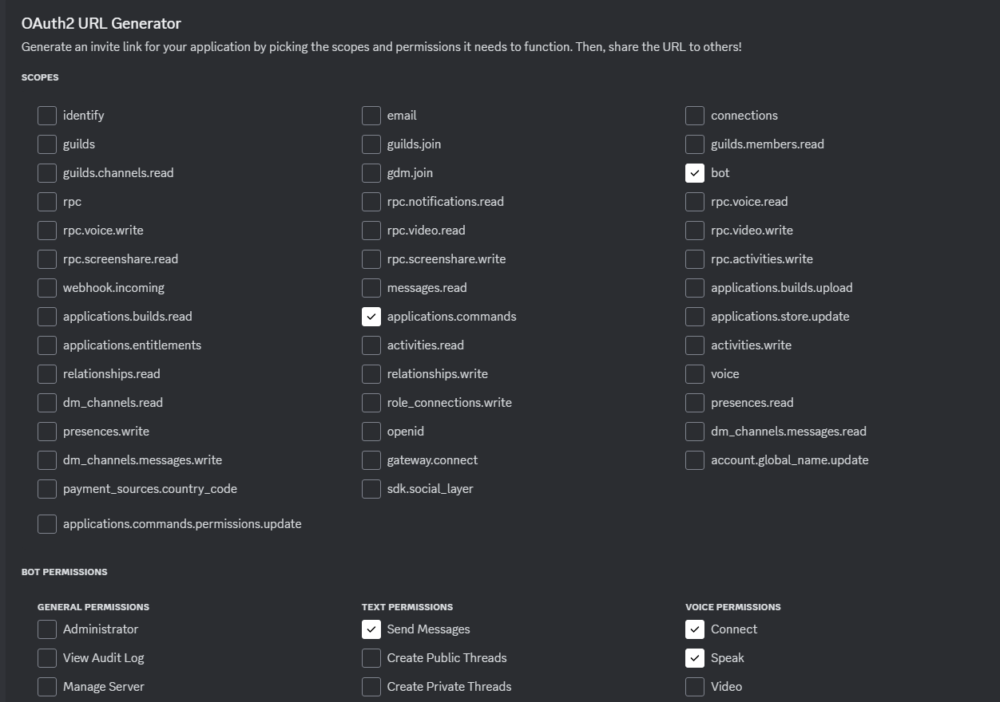

# ReadDiscordByA.I.VOICE
## 🎤 これは何？
- Discord読み上げbot
- A.I.VOICEによる読み上げ（別途A.I.VOICE Editorが必要です）
- ローカルで動く

## 🔌 クイックスタート
### 1. botを作成する
[Discord Developer Portal](https://discord.com/developers/applications)からbotを作成してください。
botの許可設定はこんな感じ

- SCOPES
  - applications.commands
  - bot  
- BOT PERMISSIONS
  - TEXT PERMISSIONS
    - Send Messages
  - VOICE PERMISSIONS
    - Connect
    - Speak

できたURLにアクセスし、サーバーに招待する

### 2. ローカルで動作させる
リポジトリをクローンしてください
```
git clone https://github.com/Sorutrt/ReadDiscordByA.I.VOICE.git
```
`.env.example`を指定のとおりに書き換え、`.env`にリネームしてください  

npmパッケージをインストールします
```
npm i
```
を実行

```
npx tsx .\src\deployCommands.ts
```
でコマンドを登録します

手っ取り早く動かすには
```
npx tsx .\src\main.ts
```
jsにコンパイルして動かすには
```
tsc -p .
node .\dist\main.js
```

これでbotの起動が完了しました！

## 🔊 使い方
`/join`でユーザーのVCに入ります  
あとは読み上げてほしい文章を打つだけ

## 🧱 開発メモ 
### コンパイル等(npm-scriptsがうまくいかない時用)
コマンドの登録
```
npx tsx .\src\deployCommands.ts
```

動作テスト
```
npx tsx .\src\main.ts
```

## その他 
質問などあればIssuesに投げてください